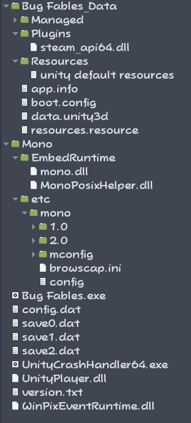
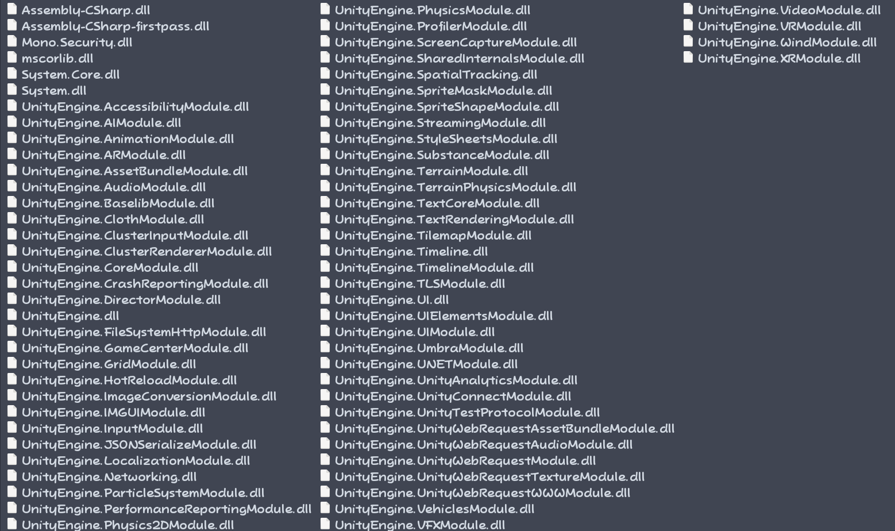

# Bug Fables files structure

Since Bug Fables is a unity game, it shares a lot of similarities with other games made with this engine. This document will primarly focus on the Steam version, but other versions should have a similar structure.

## Locating the install location
Let's first see what a Bug Fables install looks like. If you installed the game on Steam, you can access this folder directly by going into the game's properties (access it via a right click in your games's library). From there, check the Local Files section and you should see the location shown with a button to browse it. If you installed the game on GOG or the Epic Games Stores, check where those platforms installs their games to locate it. If you have it on itch, it's simply where you extracted the game.

## An overview of the files structure
This is how a typical install of the game looks:

The Managed folder under the Data folder contains many DLL files like this:

While it might seem like there's a lot of files, most of them are actually copied from Unity and the actual game is only contained in a few files.

## A breakdown of the files

Let's start at the root folder:
- Bug Fables_Data: This is where most of the game's assets and codes are located alongside data provided by the Unity engine.
- Mono: This is where Unity's custom version of the Mono runtime is located (in the Embeded runtime subfolder) alongside some configurations to it (located in the etc subfolder). This is directly provided by Unity.
- Bug Fables.exe: This is actually Unity's player executable renamed to match the game's name. It is also directly provided by Unity despite its name.
- config.dat: This is generated by the game at runtime on the first boot. It contains all the global settings configuration as well as other informations such as the language choice and which modifier code has already been entered (used to list the code allowed via the secret menu).
- save0/1/2.dat: The save files generated by the game. save0 is the first slot, save1 is the second slot and save2 is the third slot. There can also be saves with the name "backup" which is actually the game's previous save before its corresponding regular save file. This is the game's redundancy mechanism: if the current file somehow becomes corrupted, the game will falback to the backup version.
- UnityCrashHandler64,exe: This file is provided by Unity. It's a small program that is meant to be called whenever Unity player crashes. It will contain the game's icon with a red exclamation mark if it is executing.
- UnityPlayer.dll: This is most of Unity's player code. The executable mentioned above uses it and it constitutes the core Unity code compiled in C++. The C# scripting merely is an interface to this code.
- version.txt: This is just a text file with the game's version number. This file isn't actually used anywhere in the game. It is very likely just present to indicate the version without needing to boot the game.
- WinPixEventRuntime.dll: This file is provided by Unity. It seems to be a library for debugging and profiling DirectX games.

As you can see, only the Data folder actually contains the game. The only thing coming from the game are the exe's icon as well as the presence of the steam api dll.

## Bug Fables_Data

Since this is where the actual game resides, we need to specifically talk about its structure.

- Managed: This folder contains all the compiled C# code (otherwise known as "Managed" code). Only 2 files are compiled from Unity: Assembly-CSharp.dll and Assembly-CSharp-firstpass.dll. The rest are all Unity's own library (which ends up interfacing with UnityPlayer.dll) and some core library needed for running .NET in unity (System.dll, System.Core.dll, mscorlib.dll and Mono.Security.dll).
  - Assembly-CSharp.dll: This contains ALL the game's spefific code. All the contents of this files are made by Moonsprout and it contains all the game's logic and every components's code.
  - Assembly-CSharp-firstpass.dll: This only contains the Steamworks.NET code which is open source and it allows to integrate Steamworks into Unity games. The reason for the name has to do with this being used as a plugin which requires a different step in the build process. Assembly-CSharp.dll refferences this file.
- Plugins: This is where libraries loaded by the games are located. Only the Steam dll should be present which is provided by Valve through Steamworks. Steamworks.NET directly uses this file to invoke Steam's api.
- Ressources: Only contains Unity's default ressources which is directly provided by Unity.
- app.info: This is a simple file generated at build time containing the information provided to Unity at compilation which is the application name and the company name.
- boot.config: This is a file generated at build time containing some build configuration. It is possible to edit this file to change how the game will behave such as enabling the Unity debug server and setting the mono's runtime type.
- data.unity3d and ressources.ressource: These are compressed files containing all the assets of the game. Their content are entirely made by Moonsprout which Unity compiled and compressed.

That should basically cover all of it.

## Takeaways from this

The important part to understand is that the "game" is actually mostly 4 files with one being a third party module, Steamworks.NET and some minor customisations. The rest is just Unity and it's even possible to get these files from an actual Unity 2018.4.12f1 installation. Because of this, it is possible to change some files around to change a release build into a development build with debugging support. It's even possible with some decompilation work to upgrade the mono runtime to the newer version that newer versions of Unity uses.